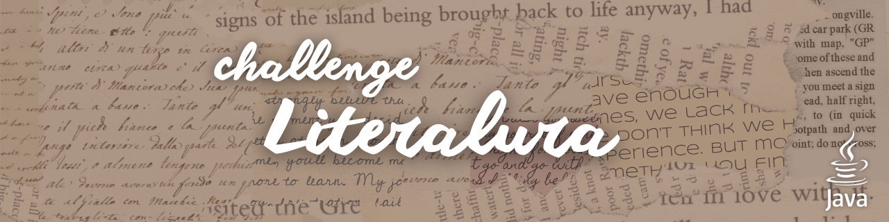

Esse é um sistema desenvolvido em Java com Spring Boot que utiliza a Gutendex API para pesquisar livros e adicioná-los ao seu próprio banco de dados, permitindo consultas e listagens via terminal.

## Funcionalidades

- Buscar livros pelo título usando a Gutendex API
- Salvar livros e autores no banco de dados
- Listar livros registrados
- Listar autores registrados
- Listar autores vivos em um determinado ano
- Listar livros por idioma

## Tecnologias Utilizadas

- Java 25
- Spring Boot
- Spring Data JPA
- PostgreSQL
- Jackson
- [Gutendex API](https://gutendex.com/)

## Persistência de dados

O sitema foi pensado e desenolvido para que o usuário pudesse salvar os livros pesquisados no seu próprio banco de dados e acessá-los sempre que quisesse. No entanto, este projeto não cria o banco de dados automaticamente. 

Antes de rodar o programa, certifique-se de:
1. ter o PostgreSQL em execução
2. criar manualmente um banco de dados (ex: `literalura_db`)
3. configurar as credenciais no arquivo `application.properties`:

```
//application.properties

spring.datasource.url=jdbc:postgresql://${DB_HOST}/literalura_db
spring.datasource.username=${DB_USER}
spring.datasource.password=${DB_PASSWORD}
spring.datasource.driver-class-name=org.postgresql.Driver
hibernate.dialect=org.hibernate.dialect.HSQLDialect

spring.jpa.hibernate.ddl-auto=update
```

Os termos `${...}` são variáveis de ambiente que configuram o acesso ao banco de dados. Antes de executar a aplicação, você pode substitui-las por seus dados ou definir as seguintes variáveis na sua máquina:

- `DB_HOST`: endereço do banco PostgreSQL  
  Exemplo: `localhost`
- `DB_USER`: usuário do banco de dados
- `DB_PASSWORD`: senha do banco de dados

> OBS.: "literalura_db" é apenas um nome de exemplo para o banco de dados. Caso utilize outro nome, substitua-o pelo nome do banco que você criou.

## Pré-requisitos

Java 17+, Maven, PostgreSQL e conexão com a internet.

## Exemplo de uso

Ao executar a classe `LiteraluraApplication`, você verá o seguinte menu:

```
----------------------------
Digite o número da sua opção:
1 - buscar livros pelo titulo
2 - listar livros registrados
3 - listar autores registrados
4 - listar autores vivos em um determinado ano
5 - listar livros em um determinado idioma

0 - sair
```

- ``1`` pesquise um livro pelo título. Caso a API retorne um livro, ele será salvo automaticamente no banco de dados, assim como seu respectivo autor.
- ``2`` consulte todos os livros registrados no banco de dados.
- ``3`` consulte todos os autores registrados no banco de dados.
- ``4`` consulte quais autores estavam vivos em um ano qualquer.
- ``5`` consulte os livros registrados em um idioma determinado (opções válidas: pt (Português), en (Inglês), es (Espanhol), fr (Francês)).

## 🍯 Autora
| [<br><sub>Melissa Wolff</sub>](https://github.com/melwolff13) |
|:-------------------------------------------------------------------------------------------------------------------------------------------------------:|

